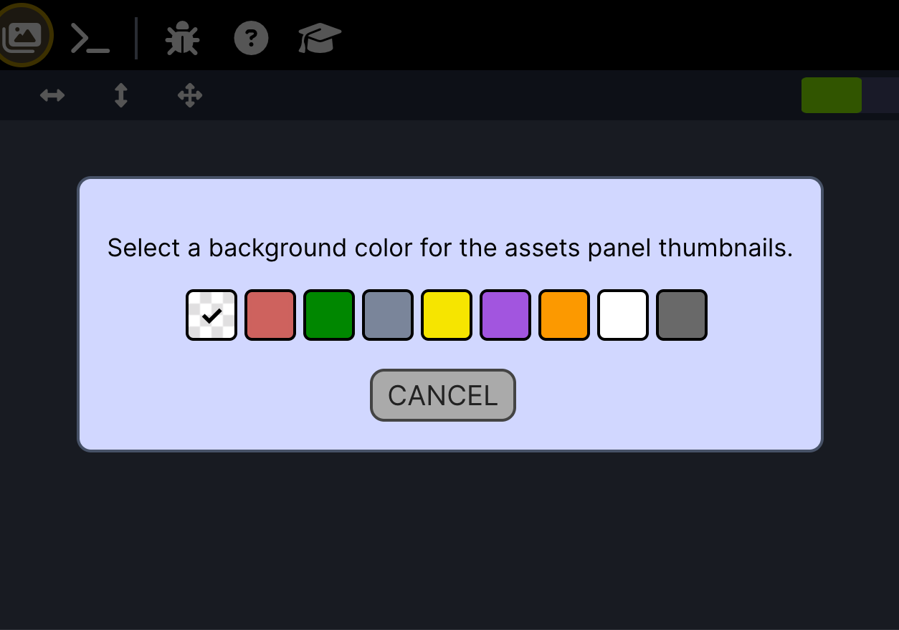

# beta.gamedevutils.com
A play site for my work-in-progress tinkerings.

## Notes / TODOs

1. **Universal Image Processing**<br/>I had been using the Canvas API to create and read images. I'd like to swap out to js-only libs for this so that I can have the same source for web, desktop, and CLI.<br/><br/>My most recent install was for the image parsers...

```shell
npm install bmp-js @types/bmp-js decode-gif jpeg-js ndarray @types/ndarray jszip uuid @types/uuid save-pixels 
```

2. **Handle Animated GIF Frames**<br/>I had planned to include a group function for assets (similar to how paint programs group layers and objects).<br/><br/>I'm having trouble determining the best way to handle the image frames that are extracted from animated GIFs, so I'm not going to expose the grouping feature to the user, but under the covers it will be used to group GIF frames. Delete one, delete all.<br/><br/>I replaced the grouping button in the assets toolbar with a color picker for the background color for the asset thumbnails.<br/><br/><br/><br/>
3. **Keep Common Code Common**<br/>I imported some files from the common project into this one for ease of development. I need to make sure that I can reverse that after things are closer to done. The `./Common` logic should be used for web, desktop, and CLI.<br/><br/>
4. **Sprite Aliasing**<br/>This feature should be especially helpful for animated GIF frames, where duplicates are likely to appear. Don't forget to implement it.<br/><br/>
5. **Store Thumbnail Background with Project?**<br/>I'm wondering if I should store the the thumbnail setting with the project or with the app. As is, it would be the only app-specific setting. And there's an argument to be made that project-by-project might be more useful.<br/><br/>But in the separation of concerns, the setting has nothing to do with the processing, and everything to do with the UI. Needs more thought. Until then, I'll have the user selecte it on every run of the app, with a sensible default ("transparent").